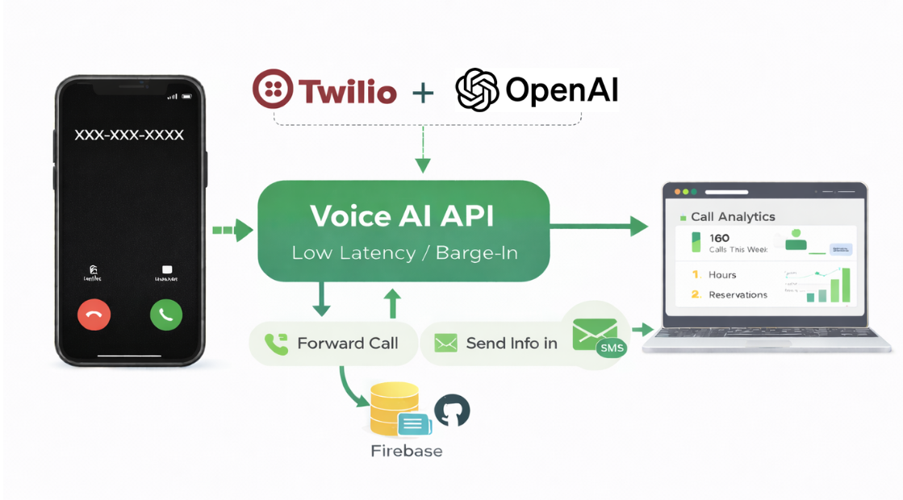
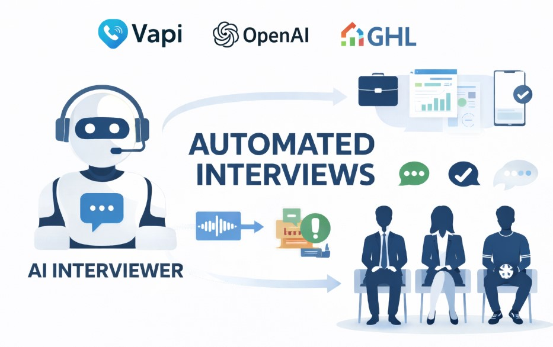

# AI Voice Agents

Production-minded AI agent projects focused on real-time interaction, telephony integration, and practical evaluation workflows.
This repository contains two independent builds you can run and extend.

## Projects

- [Restaurant AI Phone Receptionist (Twilio)](#restaurant-ai-phone-receptionist-twilio)
- [AI Interviewer Voice Agent (OpenAI)](#ai-interviewer-voice-agent-openai)

## Projects Overview

| Project | What it is | Primary stack | Folder |
|---|---|---|---|
| Restaurant AI Phone Receptionist (Twilio) | Inbound call agent for restaurant operations with live transfer and SMS tooling. | Twilio Voice, Media Streams, OpenAI Realtime, Fastify, Firebase | [`restaurant-voice-receptionist-twilio/`](./restaurant-voice-receptionist-twilio/) |
| AI Interviewer Voice Agent (OpenAI) | Adaptive interview agent that changes questions based on responses and parameters. | OpenAI Assistants API, FastAPI, Python, Jinja2 | [`ai-interview-agent-openai/`](./ai-interview-agent-openai/) |

## Restaurant AI Phone Receptionist (Twilio)

### 5-second rundown

- Handles real inbound restaurant calls with low-latency AI responses.
- Streams call audio through Twilio Media Streams and WebSockets.
- Supports interruption (barge-in), FAQ handling, and menu/location/hours queries.
- Sends SMS follow-ups (links and details) during calls when requested.
- Escalates to live staff and stores call logs for QA and analytics.

### Tech stack

- Twilio Voice, Twilio Media Streams, Twilio SMS
- OpenAI Realtime API (`gpt-4o-realtime-preview`)
- Node.js, Fastify, `@fastify/websocket`, `ws`
- Firebase Auth, Firestore, React/Vite admin tooling
- Docker, Google Cloud Run, Firebase Hosting

Where to look next: [`restaurant-voice-receptionist-twilio/README.md`](./restaurant-voice-receptionist-twilio/README.md)

## AI Interviewer Voice Agent (OpenAI)

### 5-second rundown

- Runs dynamic interviews that adapt follow-up questions in real time.
- Uses user-defined parameters to shape role focus and interview direction.
- Delivers an interactive text-based interview flow (no video required).
- Adjusts question difficulty based on candidate responses.
- Continues evaluation-oriented questioning as answers evolve.

### Tech stack

- OpenAI Assistants API
- Python, FastAPI, Uvicorn
- Jinja2 templates, HTML/CSS frontend
- `python-dotenv`, `requests`
- Heroku deployment target (plus Docker/Procfile support in repo)

Live app: [AI Interviewer Web App](https://ai-interviewer-general-bef2faaaa006.herokuapp.com/)

Where to look next: [`ai-interview-agent-openai/README.md`](./ai-interview-agent-openai/README.md)

## Repo Notes

### Who this repo is for

- Teams building production-oriented AI reception or interviewing agents.
- Developers evaluating telephony workflows, real-time interaction, and adaptive interview logic.

### How to run

Each project is self-contained and has its own setup instructions.
Use the project READMEs in `restaurant-voice-receptionist-twilio/` and `ai-interview-agent-openai/`.
